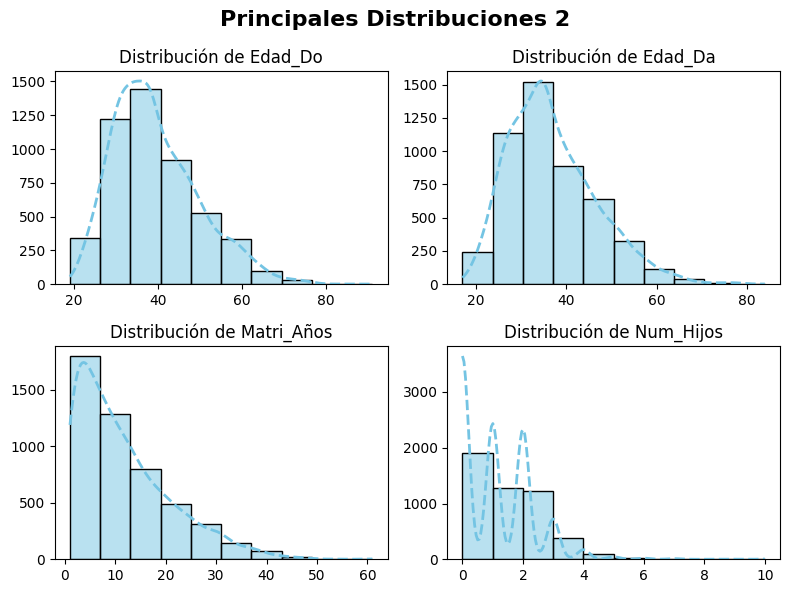

# Análisis Exploratorio de Datos (EDA) de Divorcios en México (2000 - 2015)

## 1. Introducción
Este proyecto de **Análisis Exploratorio de Datos (EDA)** se centra en un dataset de divorcios en México. El objetivo principal fue explorar las características demográficas, económicas y relacionales de las parejas al momento de su separación. A pesar de los desafíos presentados por la naturaleza del dataset (considerado "seco" por su concentración de datos y la ausencia de correlaciones complejas), se aplicaron técnicas rigurosas de **limpieza, ingeniería de características y visualización** para extraer cualquier patrón relevante.

## 2. Origen de los Datos
El dataset fue obtenido de una fuente gubernamental mexicana, conteniendo información sobre diversos aspectos de los divorcios, incluyendo fechas, edades, ingresos, ocupaciones, escolaridad, número de hijos y custodia.

## 3. Proceso de Análisis y Metodología

### 3.1. Limpieza y Preprocesamiento de Datos
Se realizó una limpieza exhaustiva del dataset, abordando valores nulos e inconsistencias:
* **Fechas:** Las columnas de fecha (`Fecha_divor`, `Fecha_matri`, `F_Naci_Do`, `F_Naci_Da`) fueron convertidas al tipo `datetime`.
* **Imputación de Nulos:**
    * **Variables cualitativas:** Los valores nulos en columnas categóricas (ej. `PaisNaci_Do`, `Ocupacion_Da`, `Custodia`, `ElTrabajo`, `ElEscolaridad`) fueron imputados utilizando la **moda**.
    * **Variables cuantitativas:** Los nulos en columnas numéricas (ej. `Edad_Do`, `Edad_Da`, `ElIngreso`, `EllaIngreso`) se imputaron con la **mediana** para minimizar el impacto de valores atípicos.
* **Cálculo y Manejo de `Matri_Años`:** Esta columna fue calculada a partir de las fechas de matrimonio y divorcio. Se identificaron y corrigieron casos de años negativos (divorcio anterior al matrimonio) convirtiéndolos a nulos y luego imputándolos.
* **`Num_Hijos`:** Los nulos en esta columna (que representaban una parte significativa del dataset) se imputaron con `0`, bajo la consideración de que la ausencia de datos indicaba la ausencia de hijos.

### 3.2. Ingeniería de Características
Para enriquecer el análisis y mitigar las limitaciones de los datos de ingresos, se crearon nuevas variables:
* **`Dif_Edades`:** Diferencia absoluta de edad entre el esposo y la esposa.
* **`Genero_mayor_edad`:** Variable categórica ('M', 'F', 'Igual') indicando quién es mayor en la pareja.
* **`Genero_mayor_ingresos`:** Variable categórica ('M', 'F', 'Igual') indicando quién reportó mayores ingresos.
* **Normalización de categorías:** Se unificaron ciertas categorías en las columnas de ocupación/trabajo para simplificar el análisis y agrupar valores similares.

### 3.3. Análisis Exploratorio Visual

Se generaron diversas visualizaciones para entender las distribuciones de las variables y explorar sus relaciones:

* **Distribuciones de Variables Cualitativas (Countplots):**
    * `ElEscolaridad`, `EllaEscolaridad`, `ElTrabajo`, `EllaTrabajo`: Se observó una prevalencia de niveles educativos "Profesional" y "Preparatoria", y la mayoría como "Empleado".
    * `Tipo_divor`: Se notó una distribución relativamente equilibrada entre divorcios "Necesarios" y "Voluntarios".
    * `Custodia`: La "MADRE" fue la opción de custodia predominantemente más frecuente.

* **Distribuciones de Variables Cuantitativas (Histogramas):**
    * `Edad_Do`, `Edad_Da`, `Matri_Años`, `Num_Hijos`: Se analizaron las formas de las distribuciones, la presencia de sesgos y la concentración de valores.
    * **Ingresos (`ElIngreso`, `EllaIngreso`):** Se confirmó que estas variables presentan una distribución extremadamente sesgada, con una gran concentración de valores en cero (o muy bajos) y una cola larga de valores atípicos, haciendo que las relaciones directas fueran difíciles de visualizar.

* **Análisis Relacional de Ingresos:**
    * **Ingresos vs. Años de Matrimonio (Scatterplots con Línea de Regresión):** Incluso tras el filtrado de valores cero y outliers extremos, las líneas de regresión para `ElIngreso` y `EllaIngreso` vs. `Matri_Años` mostraron ser **casi planas**. Esto indica una **ausencia de correlación lineal significativa** entre el nivel de ingresos y la duración del matrimonio en este dataset.
    * **`Genero_mayor_ingresos` vs. Otras Variables:** Las comparaciones entre esta variable categórica derivada y otras variables (como `Matri_Años`, `Tipo_divor`, `Custodia`, `ElEscolaridad`) revelaron que las distribuciones de estas últimas eran **relativamente consistentes** en los grupos de `Genero_mayor_ingresos`. Por ejemplo, la custodia materna siguió siendo dominante, y la proporción de tipos de divorcio se mantuvo similar, independientemente de quién tenía mayores ingresos.

## 4. Hallazgos Clave

Este análisis exploratorio ha revelado:
* **Predominancia de Custodia Materna:** La custodia de los hijos es otorgada mayoritariamente a la madre, con muy pocos casos para el padre u otras figuras, independientemente de otros factores analizados.
* **Ingresos y Duración del Matrimonio:** No se encontró una relación lineal discernible entre el ingreso individual de los cónyuges y la duración del matrimonio en los casos de divorcio. Esto sugiere que el nivel de ingreso no es un predictor directo de la duración del matrimonio en este contexto.
* **Desafío de los Datos de Ingresos:** La extrema concentración de ingresos en valores bajos o nulos es una característica dominante del dataset, limitando el tipo de correlaciones que se pueden extraer directamente de estas variables.
* **Patrones Demográficos y Educativos:** Se confirmaron las distribuciones de edad al divorcio (con mayoría en edades medias), los años de matrimonio (concentrados en los primeros años) y los altos niveles de escolaridad ("Profesional" y "Preparatoria") entre los cónyuges.

## 5. Lecciones Aprendidas

Este proyecto, aunque desafiante por la naturaleza del dataset, ha sido una valiosa oportunidad para fortalecer habilidades en:
* **Manejo avanzado de datos:** Imputación de nulos con estrategias específicas para tipos de datos (`datetime`, categóricos, numéricos) y cálculo de variables derivadas.
* **Ingeniería de Características:** La creación proactiva de nuevas columnas (`Dif_Edades`, `Genero_mayor_edad`, `Genero_mayor_ingresos`) para intentar descubrir patrones en datos "secos".
* **Visualización Efectiva:** Uso y personalización de múltiples tipos de gráficos de Matplotlib y Seaborn (`countplot`, `histplot`, `scatterplot`, `regplot`, subplots, manejo de notación científica).
* **Pensamiento Crítico en EDA:** La capacidad de interpretar no solo la presencia de patrones, sino también la **ausencia de ellos**, y de identificar las limitaciones inherentes a un conjunto de datos.
* **Resiliencia Analítica:** Aprender a navegar la frustración con datos que no ofrecen insights obvios y saber cuándo una línea de investigación ha llegado a su límite con el dataset actual.

Este análisis demuestra que incluso un dataset aparentemente "seco" puede ser una excelente plataforma para la práctica y el desarrollo de habilidades fundamentales en el análisis de datos.